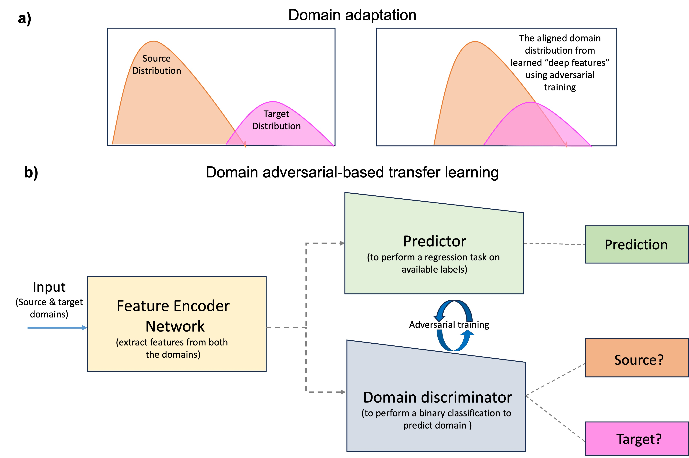

# Absolute-impedance-inversion-using-domain-adaptation
This repository contains the code for absolute impedance inversion using the domain adversarial neural network (DANN).

## Key features 
1. Here, I have shown the implementation of the DANN framework on the synthetic example. For this benchmark, the Marmousi2 model is used as a source domain (with sufficient labels) and the SEAM subsalt earth model as a target domain (very limited labels).
2. Considering the real data scenario, only 10% of the data of the SEAM model is used for training.
3. Given the different underlying lithology of both datasets, i.e., Marmousi2 and SEAM, our implementation has shown a significant efficiency in recovering the complex salt features of the SEAM model.
4. Further, to recover the absolute impedance, we showed the efficacy of the classic envelope attribute to recover the missing low-frequency information from the band-limited seismic data.
5. Along with the instantaneous phase, compensate for the lost phase information while taking the envelope. Finally, envelope and instantaneous phase attributes are fed as input along with the band-limited seismic. This work is shown in "Broadband acoustic impedance inversion using seismic multi-attributes and sequential convolution neural network". doi: https://doi.org/10.3997/2214-4609.202410820.

The implementation of the DANN along with a multi-attribute approach is discussed in "Seismic absolute acoustic impedance inversion using domain adversarial based transfer learning", doi: https://doi.org/10.1190/image2024-4099826.1

## Running the code
This code is built using PyTorch with GPU support. Follow the instructions on PyTorch's website to install it properly. The code can also be run without GPU, but it will be much slower.
First, generate the input data using the "Multiattribute_input.py" file for both datasets. And save the input files in the "data" folder. Then use the "Train_DANN.py" file to implement the DANN framework for absolute impedance inversion. 

## Data
The data required to run the train_DANN.py file, download the processed multi-attribute input data of Marmousi2 and SEAM subsalt model from;
https://iitk-my.sharepoint.com/:f:/g/personal/anjalid_iitk_ac_in/EhDB5EVNMytIse3pmNgY5M8B9s5CB6i5EH9ywYLRLnq0sQ?e=BA96Q3
